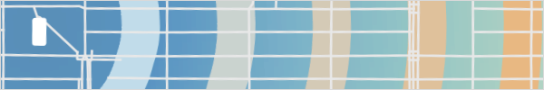
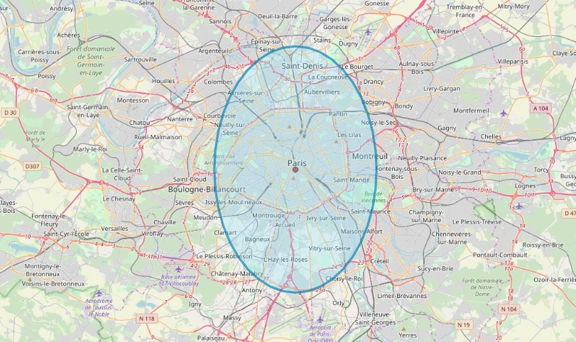
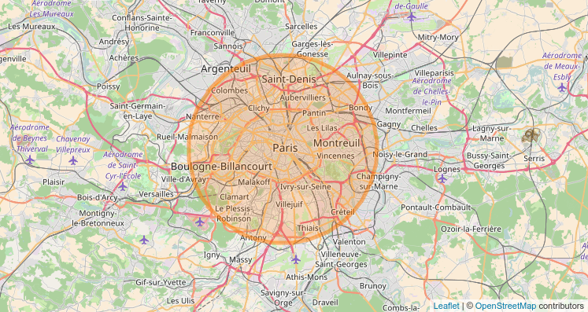

## Equal-Area Buffers for Lon-Lat Coordinates

`2017-04`

One day, I decided to hard-code creating equal area circular buffers for a given lon/lat coordinate and set radius. This came out of frustration of existing web-mapping libraries which only used lon/lat coordinates as the basis for buffers, which resulted in distortions in far away from the equator. e.g. ...



This is due to most web-mapping libraries render the world using a [Mercator projection](https://en.wikipedia.org/wiki/Mercator_projection).

The code below fixes this to create buffers that are circles (equal radius at all angles), rather than ellipses. This is written in JavaScript so it can be used with web-mapping tech like Leaflet or OpenLayers.



### Details:

First we need to setup functions for converting radians to degrees, and from degrees to radians. JavaScript only worked in radians for me, not degrees.

```js
// convert radians to degrees
function to_deg(radians) {
	return radians * 180 / Math.PI;
};

// convert degrees to radians
function to_radians(degrees) {
    return degrees * Math.PI / 180;
};
```

Since the Earth is not a perfect sphere, we need a function to compute the radius for specific latitude.

```js
function radius_at_lat(latitude) {
    r_a = 6378137.0 // equitorial radius (in m)
    r_b = 6356752.3 // polar radius (in m)
    var radius =  Math.sqrt(
      (r_a * r_a * Math.cos(latitude) * r_a * r_a * Math.cos(latitude) + r_b * r_b * Math.sin(latitude) * r_b * r_b * Math.sin(latitude))
      /
      (r_a * Math.cos(latitude) * r_a * Math.cos(latitude) + r_b * Math.sin(latitude) * r_b * Math.sin(latitude))
    );
    return radius
};
```

The [Haversine formula](https://en.wikipedia.org/wiki/Haversine_formula) computes great circle distances and the associated bearing between two points on the Earth.

Re-working this formula we can find the coordinates of a point given inputs of another point, bearing, and distance.

```js
function destination_point(degrees_lat, degrees_long, distance, angle_circle_deg) {
	var bearing = to_radians(Number(angle_circle_deg)); //
	var dr_ratio = Number(radius / radius_at_lat(degrees_lat)); // ratio of distance to
	var i_lat = to_radians(degrees_lat); // convert input to rad
	var i_lon = to_radians(degrees_long); // convert input to rad
	var d_lat = Math.asin(
		Math.sin(i_lat) * Math.cos(dr_ratio) +
		Math.cos(i_lat) * Math.sin(dr_ratio) * Math.cos(bearing));
	var d_lon = i_lon + Math.atan2(
		Math.sin(bearing) * Math.sin(dr_ratio) * Math.cos(i_lat),
		Math.cos(dr_ratio) - Math.sin(i_lat) * Math.sin(d_lat));
	// convert to long 180 to -180
	d_lon = (d_lon + 3 * Math.PI) % (2 * Math.PI) - Math.PI;
	return [to_deg(d_lon),to_deg(d_lat)];
};
```

Finally, we loop the above calculation for a given distance and set of bearings, and then output the result into a ```geojson`` object for easy display on a web map.

```radius``` is the radius in m for the circle

```edge_points``` is an integer of the number of points that make up the circle. The more points, the more "smooth" the circle.

```circle_centre_point``` is an array of ```[lon,lat]```

```js
function hopeful_circle (circle_centre_point, radius, edge_points) {
  //
  circle_buf_coords = [];
  // first point because geojson needs to close
  circle_buf_coords.push(destination_point(circle_centre_point[1],circle_centre_point[0],radius,0))
  // looping angles in a circle
  inc = 360 / edge_points
  start_d = inc
  for (x = start_d; x <= 360; x += inc) {
    hc = destination_point(circle_centre_point[1],circle_centre_point[0],radius,x);
    circle_buf_coords.push(hc);
  }
  // add to array
  circle_array = [];
  circle_array.push(circle_buf_coords);
  // add to a geojson object
  var circle_geojson = {
    "type": "FeatureCollection",
    "features": [
      {
        "type": "Feature",
        "properties": {},
        "geometry": {
          "type": "Polygon",
          "coordinates": circle_array
        }
      }
    ]
  }
  // export
  return circle_geojson
```
