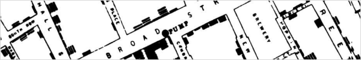
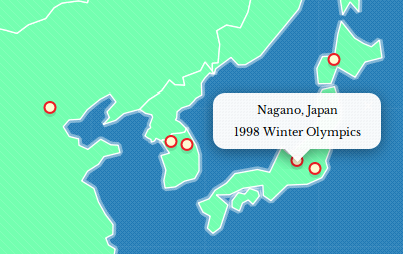
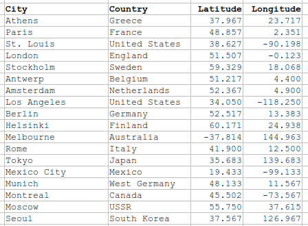
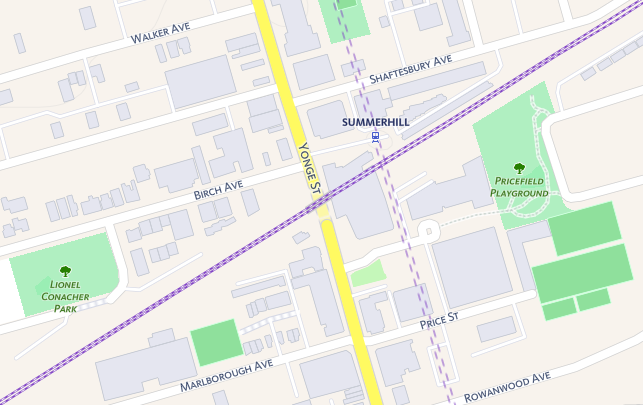
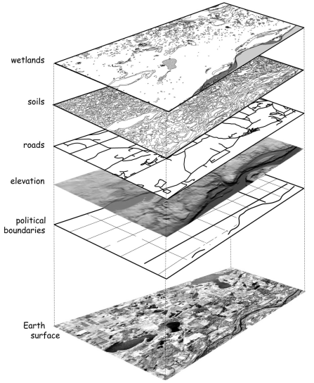
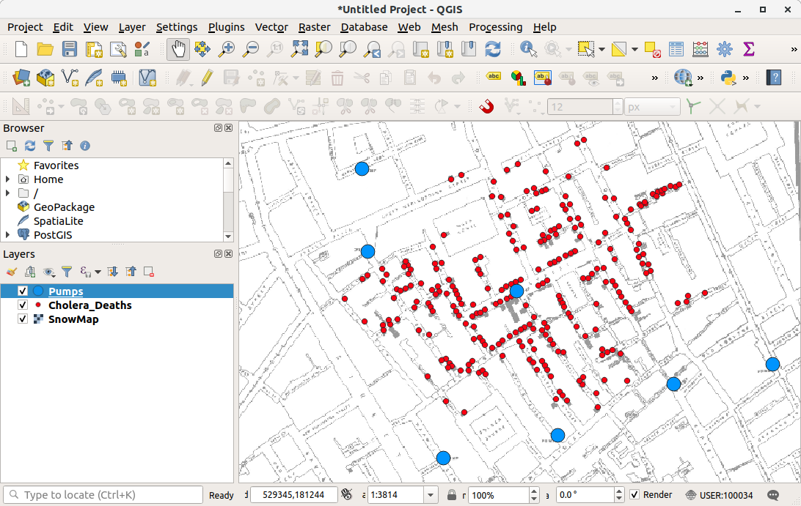
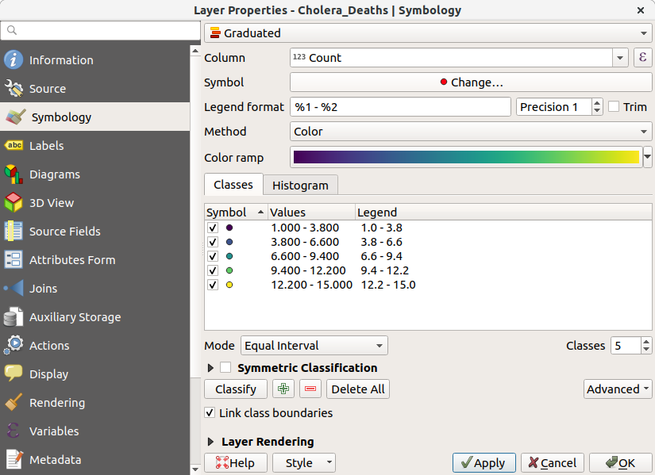
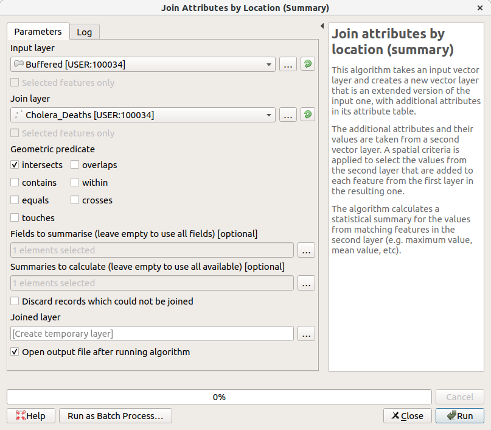
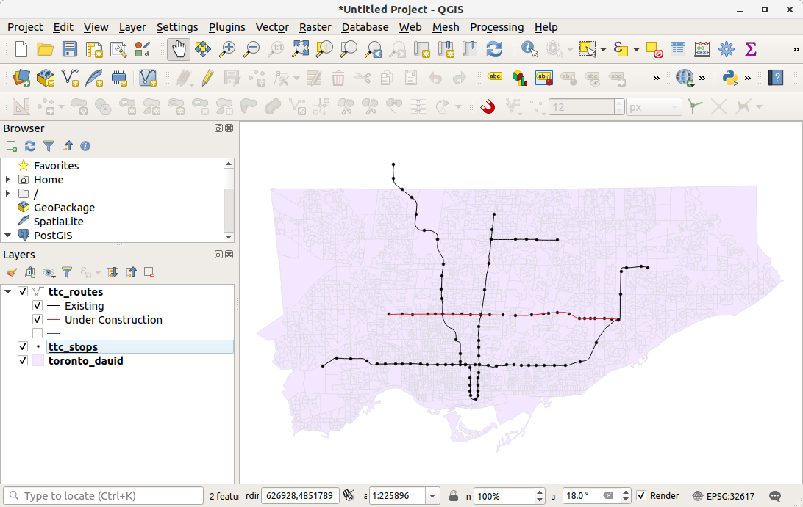
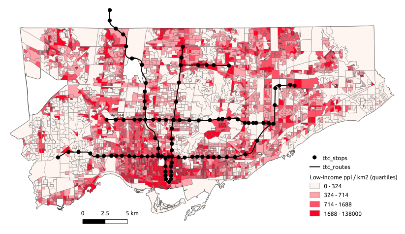

## Intro to (Q)GIS

We use Geographic Information Systems (GIS) to analyze, manipulate, and visualize spatial information on a computer.

Why is GIS useful?
- visualize spatial data
- explore spatial patterns and relationships
- make pretty and useful maps
- generate new data, either "by hand" or via spatial relationships from other data (e.g. through spatial queries)
- perform spatial analysis (i.e. statistical methods applied to spatial data)

GIS is often thought of as more than just a tool or piece of software. It can refer to all aspects of managing and analyzing digital spatially referenced data.

The following provides a brief overview of GIS followed by two short tutorials for getting started with GIS, using [QGIS](https://www.qgis.org/en/site/), a free and open source desktop GIS software. The first tutorial uses data from the 1854 cholera outbreak in London. The second analyzes demographic data from the Canadian census as well as public transit data for Toronto.

---

### 1 - Spatial Data

A spatial dataset is a combination of...
- attribute data (the **what**)
- location data and spatial dimensions (the **where**)

Spatial data, this combination of attribute and location data, can be managed and represented in a number of different ways.

For example, a city can be represented on a map via it's geographic coordinates (e.g. latitude and longitude) and then labelled or styled with any associated attribute data.

Here's some of the same data in tabular form:

Importantly, there are always uncertainty about the level of accuracy, precision, and resolution of spatial data. Spatial data are representations of reality, and thus have some loss of information when used for visualization and analysis. Any analysis can only be as good as the available data.

The two most common forms of spatial data are **vector** data and **raster** data.

#### Vector Data

Vector data uses coordinates, or a series of coordinates, to create points (like the previous example), lines, and polygons representing real-world features (e.g. lines to represent roads and rail, points for transit stops, polygons for parks and buildings, etc.). The same underlying features can be represented with different geometries, often depending on the scale of analysis (e.g. a city can be represented as point or as a polygon pertaining to it's administrative boundary).

Vector data from OpenStreetMap

#### Raster Data

Raster data represents the world as continuous grid with equal cell sizes. Each cell contains a value pertaining to the type of feature it represents. These values can be quantitative (e.g. elevation) or categorical (e.g. type of land use). Common examples of raster data include digital elevation models (DEMs), satellite imagery, and scanned images (e.g. historical maps).

DEM of Toronto and Lake Ontario (*Data from NOAA*)

---

### 2 - Spatial Data & GIS

#### Working with data in GIS

GIS software usually links to data stored elsewhere on a computer, rather than in a project file. If the source location of the data (i.e. which folder it's in) changes, then this will have to be updated in the GIS project. If data are edited in GIS, it will update the data in its source location.

The predominant data modal within a GIS is to work with data stored in different **layers** (e.g. a layer for roads, another for buildings, and so on). These layers can be visualized and analyzed in conjunction with each other based on their spatial relationships.

*Image from Bolstad (2012)*

#### Common GIS software

Desktop GIS software
- QGIS (free, open source, can do a great many things)
- ArcGIS (proprietary, used by big organizations, but loosing popularity in tech and academia)

Web-based GIS and mapping
- CARTO (commercial, free basic accounts)
- MapBox (commercial, free basic accounts)
- Tableau, D3, MangoMap, etc.

Data management & processing of spatial data
- Python, R (for processing data, statistical analysis, making simple maps)
- PostGIS (spatial databases and queries)

Many more!

---

### 3 - Tutorial, Part I

#### visualizing points and rasters, simple geo-processing

First let's download QGIS from [here](https://www.qgis.org/en/site/) if you haven't already. It can be downloaded on most Linux, Mac, or Windows computers.

Data for this example can be downloaded by clicking [here](https://github.com/jamaps/etc/raw/master/QGIS_intro/london.zip).

This includes three datasets:
- a historical map of London (a geo-referenced raster image)
- the locations of cholera deaths, a vector point dataset containing the number of deaths at each point
- the point locations of water pumps

The GIS data was originally created by [Robin Wilson](http://blog.rtwilson.com/john-snows-cholera-data-in-more-formats/) while more information about the 1854 cholera outbreak can be read on [Wikipedia](https://en.wikipedia.org/wiki/1854_Broad_Street_cholera_outbreak).

Open up QGIS. The top provides menus with a number of different options, and buttons for commonly used tools. The main panel is for visualizing and interacting with spatial data. On the left are a browser (to locate data on your computer) and the layers panel (which indicates the layers on the map, and what *order* they are displayed in). On the right there might be panels for finding processing tools, or for identifying features.

To add data, go to `Layer - Add Layer`, or by finding the file in the browser panel, and locate to where the data was downloaded onto your computer.

Let's try to accomplish the following:

1. Open and explore the data. Examine the layer structure. There are two point data files and one raster image.
2. Right-click on the layer (in the layers panel) to examine attribute tables, layer properties, among other things.
3. Practice styling layers by opening up the layer properties, going to symbology. In here, we can edit the size, shape, and colour of the layers, among other things. Let's then style the cholera_deaths layer using the graduated option. This styles the points by their values, and we can now see where there were addresses with high death counts.

GIS can do more than just styling existing data. We can also create new data via spatial relationships. As a simple example, let's try to count the number of deaths there were within 100m of each pump. This will make use of a few commonly used geoprocessing steps.

- Open up the processing panel by going to `Processing - Toolbox`
- Search for `buffer` and open up `Buffer` under `Vector Geometry`
- Navigate the window to compute 100m buffers around the Pumps layer
- Now, search for `join` and open up `Join Attributes by Location (Summary)` under `Vector General`. This tool will allow us to sum the number of deaths which overlap with each of these buffers.
- Navigate the window to input `count` into `Fields to Summarise` and `mean` in `Summaries to calculate`

Open up the attribute table of the output to see the results. There should be 194 deaths within 100m of the Broad Street pump.

---

### 4 - Tutorial, Part II

#### lines and polygons, joining tabular data, choropleths

Start up a new QGIS project and add in the data downloaded from [here](https://github.com/jamaps/etc/raw/master/QGIS_intro/toronto.zip).

First, let's look at data. We have a polygon layer which represents census dissemination areas. These are the smallest geographic level in which demographic and socio-economic data is aggregated for the Canadian census.

We also have a line layer representing major transit lines in Toronto. We can categorize line data by `status`, using different colours or line types to display whether the transit route is existing or under construction.

Also included is a `.csv` table which contains data linked to the unique identifier, `dauid`, of each dissemination area. We can use the `dauid` to join this tabular data to the spatial boundaries of dissemination areas. Do so by, first adding the table as a layer into QGIS. Then open up the properties of the dissemination area boundary, and go to join. Navigate the options by joining the data by `dauid`. Once complete, we can open up the attribute table and see these additional columns.

We can now visualize these polygons as a [choropleth map](https://en.wikipedia.org/wiki/Choropleth_map). Similar to the previous tutorial, open up the layer properties, go to symbology, and style based on graduated symbols. Notice the options available for classifying data (number of bins, whether to use quantiles or equal intervals, etc.). Different classification schemes can highlight or hide different spatial patterns. Also, it's often preferred to visualize a choropleth as a rate or a density (in terms of people per area) in order not to exaggerate counts in larger areas.

For example, the following shows a choropleth map of the density of the number of people in low-income households per km^2 in Toronto

---

### References:

Data used in these tutorials:
- [Census boundary data](https://www12.statcan.gc.ca/census-recensement/2011/geo/bound-limit/bound-limit-eng.cfm) from Statistics Canada
- [Census tabular data](https://www12.statcan.gc.ca/census-recensement/2011/geo/bound-limit/bound-limit-eng.cfm) from Statistics Canada
- [1854 Cholera Data](http://blog.rtwilson.com/john-snows-cholera-data-in-more-formats/) from Robin Wilson
- [Transit accessibility measures](ttps://github.com/SAUSy-Lab/canada-transit-access) from Jeff Allen

General GIS info:
- [Intro GIS textbook](http://www.paulbolstad.net/gisbook.html) by [Paul Bolstad](https://paulbolstad.net/)
- Some of the introductory discussion stems from slides provided by [Glenn Brauen](https://www.utsc.utoronto.ca/geography/glenn-brauen)

QGIS information:
- [QGIS Documentation \& Official Tutorials](https://docs.qgis.org/2.8/en/docs/gentle_gis_introduction/index.html)
- [Great in-depth QGIS Tutorials](https://www.qgistutorials.com/en/) by Ujaval Gandhi

<!-- GBrauen -->
