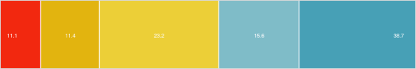

## Visualizing Mode Share & SES in the GTHA

`07-2019`

Here I visualize trends in daily travel mode share in the Greater Toronto & Hamilton Area ([GTHA](https://en.wikipedia.org/wiki/Greater_Toronto_and_Hamilton_Area)), with focus on its bi-variate relationships with socio-economic status (SES)

Data is from the 2016 [Transportation Tomorrow Survey](http://dmg.utoronto.ca/transportation-tomorrow-survey/tts-introduction) (TTS).

The TTS is a 5% sample in the region (only 3% for Hamilton), and includes a set of expansion weights to extrapolate to population level estimates.  

I originally accessed individual level data on a secure server. I cross-tabbed every trip in the dataset by categories of mode, income, car-ownership and other demographics. I exported this table, and I uploaded [here](https://github.com/SAUSy-Lab/mode-share-GTHA/tree/master/trip_cross_tabs)

The data were subset to only include persons 18 years and older, and only for trips that begin and end in the GTHA. The reason for the latter, is that we do not have accurate data for travel times to places outside of the region.

The result is a summary of %%n = %% 534,301 trip in the survey, which can be expanded to %%N = %% 11,533,176. This is roughly equivalent to a little over 2 trips per person, on average. Let's start by plotting the overall mode share of these trips:

[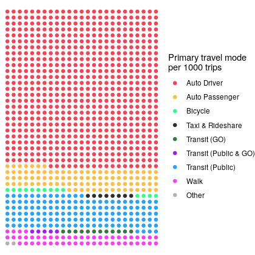](img_mode.png)

Here in table form, population totals and percentages:

```R
# A tibble: 9 x 3
  mode_cats                total    prop
  <fct>                    <dbl>   <dbl>
1 Taxi & Rideshare        89090. 0.00772
2 Transit (GO)           140233. 0.0122
3 Transit (Public)      1633317. 0.142  
4 Transit (Public & GO)   61959. 0.00537
5 Auto Driver           7706752. 0.668  
6 Auto Passenger        1118211. 0.0970
7 Bicycle                166497. 0.0144
8 Other                   22995. 0.00199
9 Walk                   594121. 0.0515
```

Indeed the majority of trips in the region are by car, either as a driver or passenger (76.5%)


### Mode & Household Income

[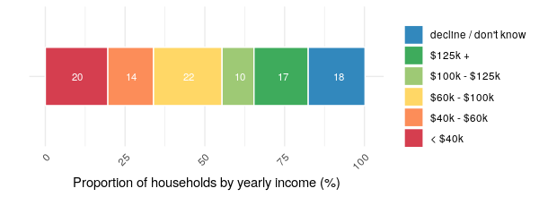](img_income.png)

From previous [research](https://uttri.utoronto.ca/files/2014/10/Planning-for-Transit-Equity-in-the-GTHA-Presentation-May-29-2019.pdf), we know that lower-income people take fewer daily trips, likely due to the costs of travel as well as participating in different activities. Here's a quick plot of mean number of trips by people in each income bracket.

[](img_trips_income_per_day.png)

Our interest here is looking at how people in different income groups vary in terms of their travel mode. So let's first plot travellers in each mode by their household income.

[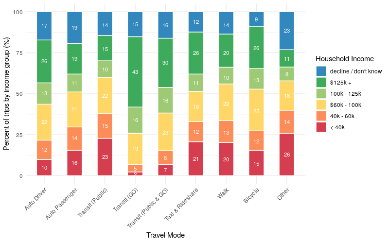](img_mode_income_1.png)

A few interesting things here: 10% of drivers are in low-income households compared to 23% of public transit riders.
Second, only 2% of people who travel by GO are in low-income households, compared to 43% who are in the highest income bracket. Likely because GO transit primarily serves wealthy suburban commuters.

Now let's flip this around and look at the percent of trips by mode for each income group. First let's look at active travel. We find that ow-income people are more inclined to walk than higher income brackets. Although there is less of a difference when looking at cycling.

[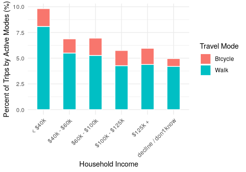](img_mode_income_active.png)

Looking at transit, indeed we see that transit ridership is highest for low-income households, just over 25% of trips. Similar to before, GO ridership is greatest for higher-income households.

[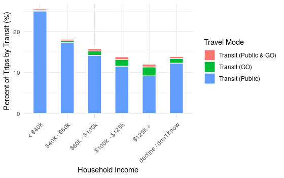](img_mode_income_transit.png)

Looking by car, indeed rich people drive more. But still, over 50% of trips by people in low-income households are conducting via driving, and another 10% as a passenger in a car.

[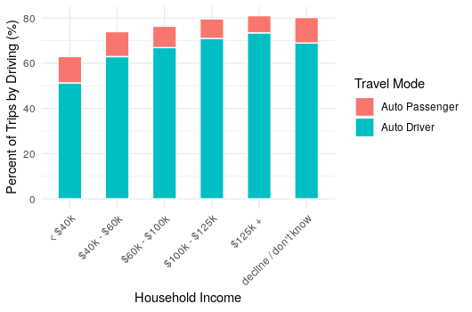](img_mode_income_drive.png)

### Mode share and auto ownership

[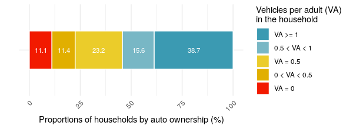](img_cars.png)

Only 11% of households don't have cars, while nearly 40% have a car for each adult.

Let's look at car ownership for those who travel by different modes.

[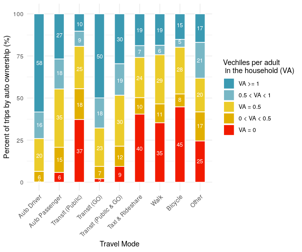](img_mode_car.png)

Unsurprisingly, people who drive have cars. While a smaller proportion of those who use alternative modes (public transit, walk, bike, taxi/rideshare) have cars. This could be by choice, i.e. these people live in areas where there are alternatives to car travel and thus choose not to buy a car, or not by choice, i.e. they cannot afford to buy a car, and are thus reliant on alternative modes. Many people who use alternative travel modes still have cars though, particularly those who use GO transit as many of these people live in the suburbs.

Let's flip this around again, looking at the mode share by categories of household auto ownership.

[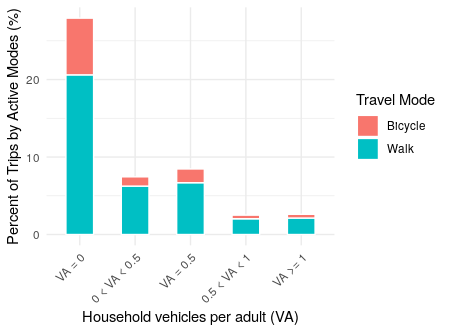](img_mode_car_active.png)

People in households without cars indeed do a lot more active travel (it's uncertain though whether this is due to preference or necessity).

Similar trends when looking at transit, but with a greater percent of trips.

[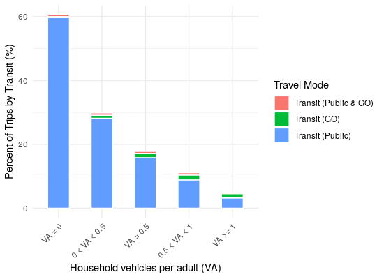](img_mode_car_transit.png)

And as expected, increasing number of trips by car with auto-ownership.

[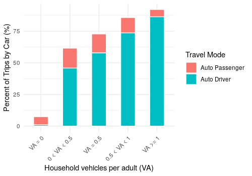](img_mode_car_drive.png)

The above also indicates that people tend to be passengers more often when there are fewer cars per adult in the household.


---
